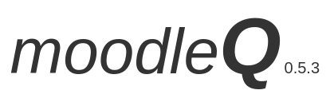
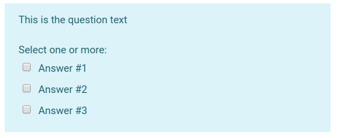

***
__Miguel A. Castellanos__ and __José C. Chacón__

mcastellanos\@psi.ucm.es
jchacon\@psi.ucm.es 


Universidad Complutense de Madrid

***
Updates: added gapselect question type
***
__moodleQ__ is an R package for the creation of question banks for moodle from a perspective based on R6 classes and object oriented programming (OOP), it allows you to easily create questions of the main types that moodle has. The questions are saved in an xml file that is imported into moodle into your question bank. This system is much faster than creating questions one by one using moodle's graphical interface and allows you to design more complex questionnaires.

Some of the things it allows you to do are:

* Build questionnaires very quickly from files or databases.
* Prepare exams easily with questions and documents in any format embedded in the questions.
* Create questions with embedded databases to be downloaded and analyzed individually for each student.

***

## Installation and first steps

The package can be installed via devtools and github

```R
devtools::install_github("mcstllns/moodleQ")
```

If not already installed, devtools can be installed with

```R
install.packages("devtools")
```

and once the package is installed it is loaded with

```R
library(moodleQ)
```

The questions are created by invoking the constructor _question$new()_. The function arguments are the parameters that define a question. Each question type has defined default parameters or fields that must be filled in for it to be a valid question. Many of these parameters have been defined by default, although they can be modified (see the default settings at the end of this document); for example, the _single_, _shuffleanswer_ and _answernumbering_ arguments can be modified to change the way the question's alternatives are marked, randomized and numbered, respectively. The question is integrated into the Q questionnaire which is saved in xml to be imported into the moodle question bank.


```R
q1 <- question$new(
  type="multichoice",
  'name' = "Q001",
  'question' = "This is the question text",
  'single' = 'false',
  'shuffleanswers' = 0,
  'answernumbering' = 'none',
  'answer' = list("Answer #1", 100),
  'answer' = list("Answer #2"),
  'answer' = list("Answer #3"))

Q <- quiz$new(q1)
Q$save_xml('myfile.xml')
```




***

## Documentation

* Go to the page with the documentation: [mcstllns.github.io/moodleQ/](https://mcstllns.github.io/moodleQ/)
* Download the documentation in pdf and example code: [moodleQ-man.zip](./docs/moodleQ-man.zip)
* Go to the github page: [mcstllns/moodleQ](https://github.com/mcstllns/moodleQ)


